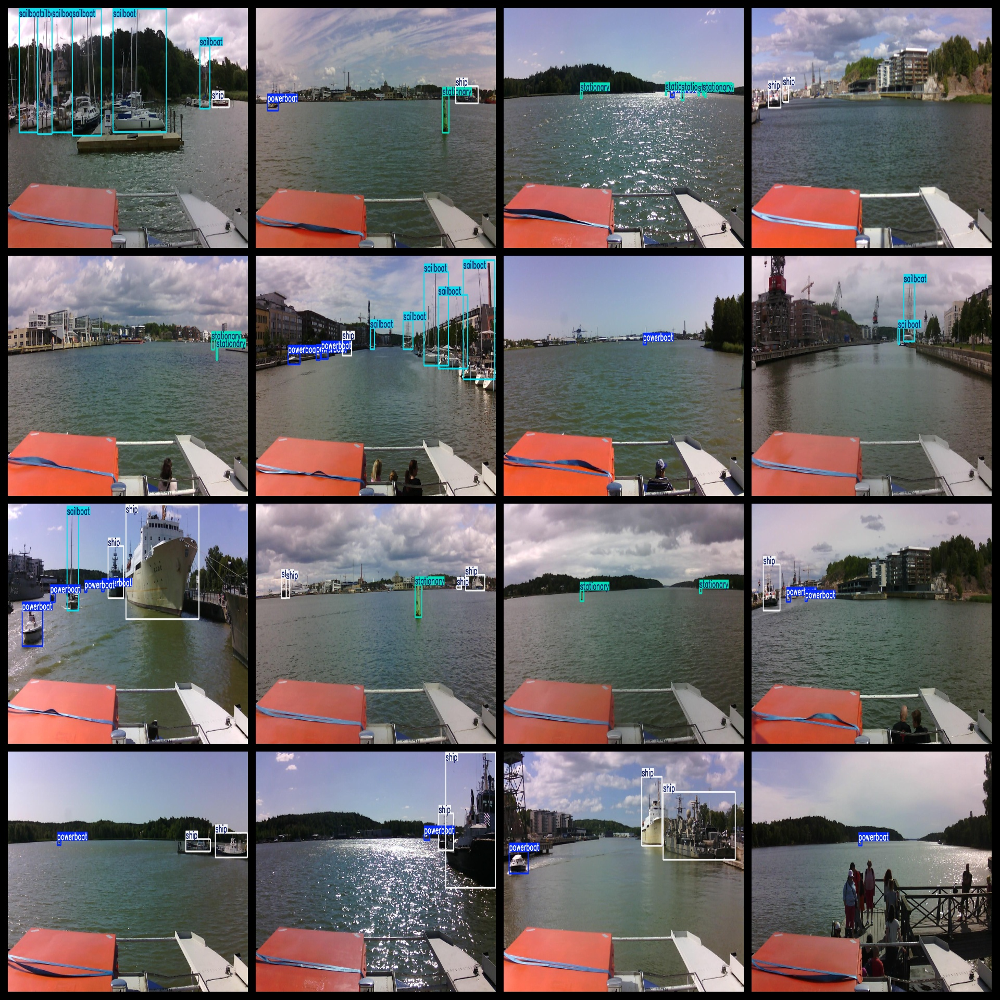

# Small Target Ship Detection Dataset 9041 imagesVOC+YOLO format

Small target ship detection dataset 9041 VOC + YOLO format

Dataset format: Pascal VOC format + YOLO format (the txt file does not contain the split path, it only contains jpg images and corresponding VOC format xml files and yolo format txt files)

Number of images: 9041

Number of xml files: 9041

Number of txt files: 9041

Number of annotated categories: 4

The Github repository is: datasets_sl

```
['powerboat', 'sailboat', 'ship', 'stationary']
```

Motorboats, sailboats, ships, other fixed objects

Number of boxes labeled in each category:

Powerboat Frame Count = 10005

sailboat frame count = 8147

The number of ships = 15945

The number of stationary frames is 7870.

Total number of frames: 41967

Number of images per category:

Powerboat occupies a total of 5048 images.

Sailboats have 3842 images.

Ship occupies 5975 pictures.

Stationary occupancy = 3824

Image resolution: 1280x720

Use the labeling tool: labelImg

Dataset Augmentation: No

Rules for annotation: Draw a rectangle around the category.

Important note: The dataset does not have been divided into training, validation, and testing sets.

Special Disclaimer: This dataset does not guarantee the accuracy of the trained models or weight files.

## Images



---

Here is a pay link on Stripe (https://buy.stripe.com/3cs8yP7sY87d0vu9AB). Please contact me lonlonago@foxmail.com after funding $89, and I will send you a complete data files, thank you!


